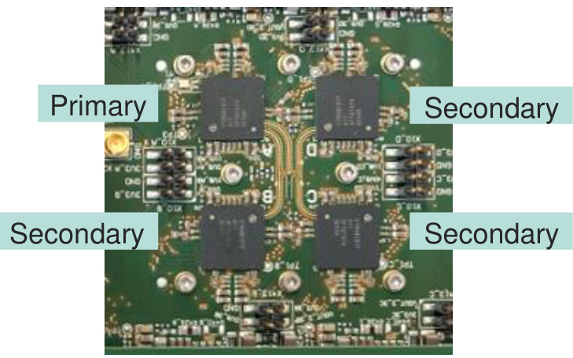

# Infineon 77GHz Imaging Radar Solutions  

Michael Thomas – Systems Applications Engineer Radar and ADAS Domain Applications September 27, 2024  

# Radar Trends – Why Imaging Radar?  

Infineon CTRX8191F 77GHz Radar MMIC  

8  

  

Infineon AURIX™TC45 MCUs for 77GHz Imaging Radar  

10  

Infineon Radar Solutions  

12  

# SAE ADAS / AD Levels – where is 77GHz Imaging Radar needed?  

  

${}^{\star}\mathrm{ODD}=($ Operational Design Domain, which refers to the set of driving conditions such as weather, geography, time of day, traffic and road conditions.  

# Infineon Definitions  

HD Imaging Radar ≥ 16T16R  

4D Imaging Radar   
8T8R – 12T12R  

Standard Radar ≤ 4T4R  

# Different driving expectations between L2+ and L3/L4 needs different sensor configuration and much better performance  

  

From L3 onwards increase performance is paramount  

# Separability drives Dynamic Range, Azimuth & Elevation resolution Infineon’s radar solution scales RF channels to match separability needs.  

  
Resolution1) in Azimuth   
1) high-resolution algorithms not included  

# 8T8R CTRX8191F enables 4D and HD Imaging Radar Solutions with excellent RF Performance and low-cost RF Laminates.  

First 8T8R Antenna Feed-inPackage cascading  

Excellent detection range: $>250~\mathrm{m}$  

Excellent azimuth angular performance with elevation angle estimation  

Premium software packages and CarKit soon available to support Fast Time to Market  

  

Radar Trends – Why Imaging Radar?  

# Infineon CTRX8191F 77GHz Radar MMIC  

8  

  

Infineon AURIX™TC45 MCUs for 77GHz Imaging Radar  

10  

Infineon Radar Solutions  

12  

# CTRX8191F enables cascaded 4D/HD Imaging Radar solutions with excellent RF performance and low-cost RF PCB´s.  

  

# Future-proof performance and flexibility to cope with future automotive radar needs.  

CTRX8191F key characteristics:  

4 Transmitters $+\,4$ Receivers Digital PLL enables situation based on-the fly modulation adaption, e.g. from highway (high speed) to parking (high resolution) Cascading via 26GHz LO self-feeding ports $(1\times\mathsf{L O}_{\mathsf{O U T}}$ ,$2\times\mathsf{L O}_{\mathsf{I N}})$ allows low-cost substrates and symmetrical designs for fast TTM Antenna-Feed-in-Package (AFiP) for lower system cost and larger system link budget   
MMIC platform approach enables scalable Imaging Radar segments from 8T8R up to 40T40R  

  

  

  

3  

Infineon CTRX8191F 77GHz Radar MMIC  

8  

Radar Trends – Why Imaging Radar?  

# Infineon AURIX™TC45 MCUs for 77GHz Imaging Radar  

10  

Infineon Radar Solutions  

12  

# AURIX™ TC45x enables 4D imaging Radar solution by offering Scalability, Large internal SRAM and Efficient Radar Processing  

Monolithic MCU with integrated SRAM and NVM Embedded 10MB SRAM and 4MB NVM hence no external memory needed  

‒ Dedicated Radar Direct Memory Access (DMA) Reduced Latencies up to 400MBins/s for fast data transfer from and to Radar SRAM with large bandwidth  

Signal Processing Unit (SPU3.0) for radar pre-processing Up to 800Msamples/s sampling rate with interference detection, mitigation / repair functionality  

  
AURIXTM T45x  

Parallel Processing Unit (PPU) with Scalar Core $\scriptstyle+$ SIMD Vector DSP for linear algebra acceleration and post-processing acceleration of matrix & vector operations with up to 77GOPS $^+$ 800 DMIPs ASIL-B for radar signal post processing functions  

PCIe enables cascading of 2xTC45 for higher channel Radar system Achieve high performance $\mathbf{16x16}$ and $\phantom{-}24\times24$ radar system using 2xTC45x  

  

Radar Trends – Why Imaging Radar? 3  

Infineon CTRX8191F 77GHz Radar MMIC  

8  

  

Infineon AURIX™TC45 MCUs for 77GHz Imaging Radar  

10  

# Infineon Radar Solutions  

12  

# From 8T8R to 24T24R and beyond CTRX8191F + AURIX™ TC45: Powering imaging radars  

  

  

  

Cost efficient  

No RF substrates No external memory No external buffers  

Performance  

Better object separability Higher resolution Larger range/field-of-view  

Scalability  

Reuse software Reuse hardware Scalable systems  

  

# AURIX™ TC45x provides a cost effective and optimized feature set for cascading up to 6x CTRX8191F  

  

1x TC45x with 10MB Radar SRAM is optimized for 8T8R   
and 12T12R use cases   
Cascade 2x TC45x using PCIe for 16T16R and 24T24R   
2x TC45x cascade will work over the specified temperature   
range i.e., $-40^{\circ}$ to $150^{\circ}\mathrm{C}$ Using 2x TC45x provides combined 20MB SRAM, 2x SPU3.0, 2x PPU for more processing performance   
PCIe makes shared SRAM between cascaded controllers   
transparent.  

# Speed up development time Infineon offers multiple ways to evaluate CTRX  

# CCTTRRXX88119911FF ssaammpplleess  

# CCTTRRXX  PP22SS  bbooaarrdd  

# CCAARRKKIITT  

For module development  

Full CTRX measurement capabilities  

  

  

Full module for initial data collection & accelerating module development  

  

CTRX performance reference  

Reference design with schematics, layout, BOM, etc  

# Infineon = trusted partner for 77GHz automotive Radar  

#  

# QUALITYLEADER  

Zero Defect is part of our DNA. Infineons products are designed with reliability and manufacturability in mind $\Rightarrow$ ensuring high product quality at lowest dpm level resulting in reliable radar sensors.  

  

# PERFORMANCE FIT  

Infineon offering longest range, widest field-of-view, and most robust radar sensors thanks to best-in-class RF & compute performance.  

  

# -BROAD PORTFOLIO  

Infineon covers all radar sensor segments - from standard NCAP radar sensor to Base Corner to High resolution radars - and across all architectures - from Full-processing to Pre-processing to Raw-data streaming  

  

# - MOST EXPERIENCED  

Infineon is the industry's radar gold standard for 77GHz: More than 15 years of Radar experience with >30oMpcs RASIC TM MMICs and >20oMpcs AURIXTM micro-controllers on the road.  

  